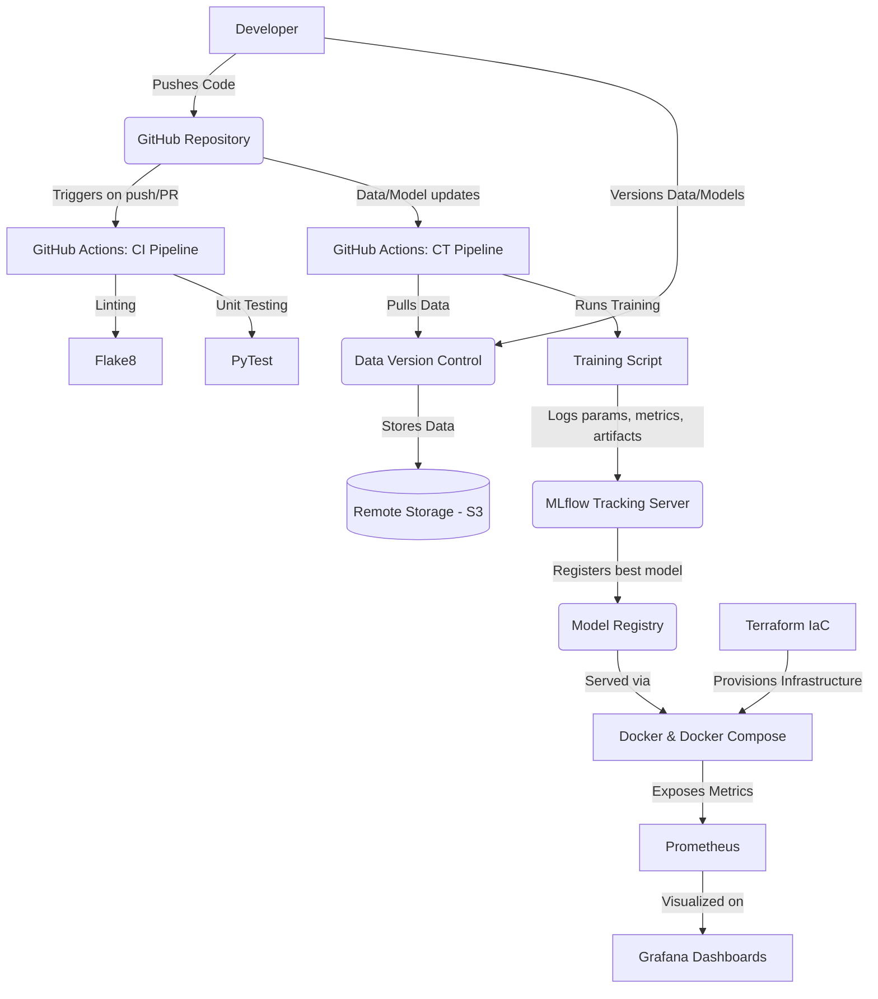

# Complete MLOps Implementation Documentation

This document outlines the entire Machine Learning Operations (MLOps) workflow implemented in the AQI Prediction project. It details the technologies used, why they were chosen, their specific use cases, and their exact locations within the project structure.

## 1. MLOps Architecture Flowchart

---

## 2. Tech Stack and Justification

### 1. Docker & Docker Compose (Containerization)
* **What it is:** Tools for packaging applications and their dependencies into standardized units called containers.
* **Why it was chosen:** It ensures that the application runs identically across different environments (development, staging, production). It eliminates the "it works on my machine" problem.
* **Use case:** Containerizing the FastAPI/Flask backend, React frontend, MLflow tracking server, Prometheus, and Grafana into an orchestrated multi-container application.
* **How it works:** `Dockerfile` defines the environment for a single service. `docker-compose.yml` orchestrates multiple interconnected containers, mapping ports, mounting volumes, and setting environment variables.

### 2. GitHub Actions (CI/CD and Continuous Training)
* **What it is:** A CI/CD platform integrated directly into GitHub to automate software workflows.
* **Why it was chosen:** Seamless integration with the code repository, zero setup overhead for infrastructure, and powerful event-driven triggers.
* **Use case:** Automating code linting, unit testing (CI), and executing automated model training pipelines (CT) whenever new data or training scripts are pushed.
* **How it works:** YAML files in `.github/workflows/` define jobs, steps, and triggers. Runners execute these steps in isolated virtual environments on every specified trigger (e.g., push, PR).

### 3. MLflow (Experiment Tracking & Model Registry)
* **What it is:** An open-source platform for managing the end-to-end machine learning lifecycle.
* **Why it was chosen:** It provides a centralized repository to compare different model runs, track hyperparameters, and manage model versions, which is crucial when iterating on ML models.
* **Use case:** Tracking model metrics (MSE, MAE, R2) during the training of the AQI models, and storing the serialized model artifacts for deployment.
* **How it works:** During training, MLflow's Python API (`mlflow.log_param`, `mlflow.log_metric`) sends data to the MLflow tracking server running as a Docker container.

### 4. Prometheus & Grafana (Monitoring & Observability)
* **What it is:** Prometheus is a time-series database and monitoring tool; Grafana is an interactive visualization web application.
* **Why it was chosen:** Standard industry tools for robust, real-time monitoring. Prometheus efficiently scrapes and stores metrics, while Grafana provides highly customizable dashboards.
* **Use case:** Monitoring system health (CPU, memory), API latency, request rates, and tracking model drift or prediction anomalies in production.
* **How it works:** The backend exposes a `/metrics` endpoint. Prometheus scrapes this endpoint periodically (defined in `prometheus.yml`), and Grafana queries Prometheus to render charts.

### 5. Terraform (Infrastructure as Code - IaC)
* **What it is:** An open-source IaC tool for provisioning and managing cloud infrastructure using a declarative configuration language.
* **Why it was chosen:** It makes infrastructure reproducible, versionable, and scalable.
* **Use case:** Defining the cloud infrastructure (like AWS S3 for DVC, RDS for MLflow's backend store, and ECS/Kubernetes for container hosting).
* **How it works:** `main.tf` defines resources. Running `terraform apply` provisions the exact infrastructure declared in the code.

### 6. Data Version Control (DVC)
* **What it is:** An open-source version control system for machine learning projects, designed to handle large files, datasets, and ML models.
* **Why it was chosen:** Git is not optimized for large binary files or datasets. DVC solves this by storing metadata in Git and the actual data in remote storage (e.g., S3).
* **Use case:** Versioning the AQI datasets and large trained model files.
* **How it works:** DVC tracks data files, generating a `.dvc` file that is committed to Git. The actual data is synced to remote storage via `dvc push` and `dvc pull`.

---

## 3. Exact Implementation Locations

Here is exactly where each MLOps component is implemented in the repository:

### A. CI/CD Pipeline (GitHub Actions)
* **File:** `.github/workflows/ci.yml`
* **Lines:** Lines 1-53
* **Details:** Triggered on pushes to `main`. 
  - `test-backend` job (Lines 10-37): Sets up Python 3.10, installs dependencies, runs `flake8` for linting, and executes `pytest` for unit testing.
  - `build-frontend` job (Lines 38-53): Sets up Node.js 18, installs dependencies (`npm ci`), and builds the React frontend.

### B. Continuous Training Pipeline (CT)
* **File:** `.github/workflows/train.yml`
* **Lines:** Lines 1-41
* **Details:** Triggered manually or when changes are made to `data/**` or `backend/training/**` (Lines 6-9).
  - Simulates pulling data using DVC (Lines 27-32).
  - Executes the MLflow training script (Lines 33-41).

### C. Container Orchestration & Monitoring Services
* **File:** `docker-compose.yml`
* **Lines:** Lines 1-54
* **Details:** Orchestrates the entire environment.
  - `backend` (Lines 4-18): Builds from the root Dockerfile, mounts data/models, connects to MLflow.
  - `frontend` (Lines 19-28): Builds from `frontend/Dockerfile`.
  - `mlflow` (Lines 29-38): Runs the MLflow tracking server on port 5000.
  - `prometheus` (Lines 39-46): Runs Prometheus, mounting `prometheus.yml`.
  - `grafana` (Lines 47-54): Runs Grafana on port 3000, depending on Prometheus.

### D. Prometheus Configuration
* **File:** `prometheus.yml`
* **Lines:** Lines 1-10
* **Details:** Configures the scrape interval (15s) and instructs Prometheus to scrape metrics from the `backend:7860` target.

### E. Infrastructure as Code
* **File:** `terraform/main.tf`
* **Lines:** Lines 1-30
* **Details:** Contains simulated infrastructure definitions.
  - Lines 13-17: Simulation of an S3 bucket for DVC remote storage.
  - Lines 19-23: Simulation of an RDS Postgres database for the MLflow tracking server.
  - Lines 25-29: Simulation of an ECS Cluster for hosting the application containers.

### F. Dockerfiles
* **Backend:** `Dockerfile` (Root directory) - Packages the Python environment and application code.
* **Frontend:** `frontend/Dockerfile` - Packages the React application.
